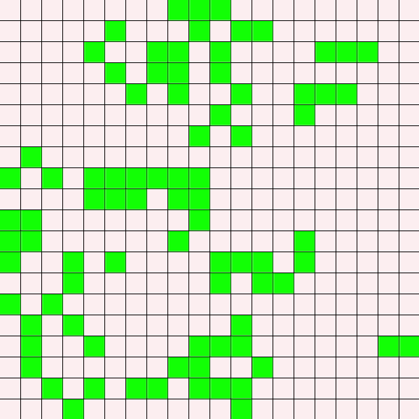

# game-of-life
###### Simple Python implementation of [Conway's Game of Life](https://en.wikipedia.org/wiki/Conway's_Game_of_Life)

This version allows you to change
- Screen size
- Number of generations
- Game speed
- Colors of cells

The game only uses [pygame](https://www.pygame.org/docs/) library for GUI
###### The 1.0 version was released on 14.11.2021